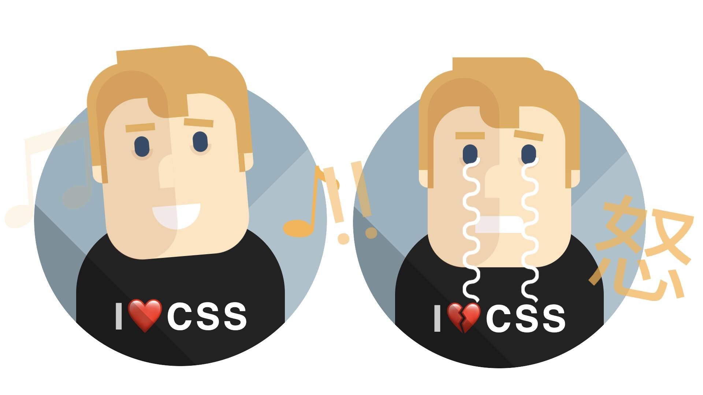

# AI Captcha - The Emotional Developer



This project is a creative and interactive web application that subverts the traditional "prove you're not a robot" captcha. Instead of identifying traffic lights or distorted text, users are challenged to interact with an AI-powered character who plays the role of a web developer. The goal? To see if you can say something that would be professionally upsetting or humiliating enough to make the character "cry."

## How It Works

The application provides a simple interface with a text input field and an animated character built purely with CSS. Here's the workflow:

1.  **User Input**: The user types a message into the input field, with the prompt "Hurt me if you can."
2.  **API Request**: The submitted text is sent to a SvelteKit backend API endpoint (`/api/captcha`).
3.  **AI Analysis**: The backend forwards the user's message to the **OpenRouter AI API**, specifically using the `meta-llama/llama-4-scout` model. The AI is given a system prompt to act as a web developer and determine if the user's statement is professionally upsetting.
4.  **Structured Response**: The AI returns a structured JSON response containing:
    - `makeHimCry` (boolean): `true` if the statement is deemed upsetting, `false` otherwise.
    - `developer.response` (string): A textual response from the "developer" explaining their reaction.
5.  **Frontend Reaction**: The frontend receives this JSON data and updates the UI accordingly:
    - The animated character's expression changes. If `makeHimCry` is `true`, the character starts crying, its heart icon breaks (💔), and other visual cues appear.
    - The `developer.response` text is displayed in a speech bubble above the character's head.

## Features

- **Interactive AI Character**: An animated character built entirely with CSS that provides real-time emotional feedback.
- **AI-Powered Content Analysis**: Utilizes a large language model to analyze the sentiment and professional context of user input.
- **Dynamic UI**: The user interface, built with Svelte, reacts instantly to the AI's response.
- **Not a Real Captcha**: A fun exploration of AI interaction, not intended for actual security purposes.

## Tech Stack

- **Framework**: [SvelteKit](https://kit.svelte.dev/)
- **Language**: [TypeScript](https://www.typescriptlang.org/)
- **AI**: [OpenRouter AI API](https://openrouter.ai/) (using Meta Llama 4 Scout)
- **Styling**: Pure CSS for all animations and character design.
- **Package Manager**: [pnpm](https://pnpm.io/)

## Getting Started

To run this project locally, follow these steps:

**1. Clone the Repository**

```bash
git clone https://github.com/your-username/ai-captcha.git
cd ai-captcha
```

**2. Install Dependencies**

This project uses `pnpm`. You can install it with `npm install -g pnpm`.

```bash
pnpm install
```

**3. Set Up Environment Variables**

You will need an API key from OpenRouter to use the AI service.

- Create a file named `.env` in the root of the project.
- Add your OpenRouter API key to the file:

```env
# .env
AI_API_KEY="sk-or-v1-..."
```

**4. Run the Development Server**

```bash
pnpm dev
```

The application should now be running on `http://localhost:5173`.

## Project Structure

```
/
├── src/
│   ├── component/
│   │   ├── CaptchaForm.svelte  # The main form component for user input.
│   │   └── character.svelte    # The CSS-animated character component.
│   ├── lib/
│   │   └── index.ts            # Svelte stores for state management.
│   └── routes/
│       ├── +page.svelte        # The main page of the application.
│       └── api/
│           └── captcha/
│               └── +server.ts  # The backend API endpoint that calls the AI.
├── static/
│   └── favicon.png
└── svelte.config.js
```

## Credits

- The animated character design is inspired by the work of [Aakash Rodrigues](https://codepen.io/aakashrodrigues) on [CodePen](https://codepen.io/aakashrodrigues/pen/MWpRwz).
